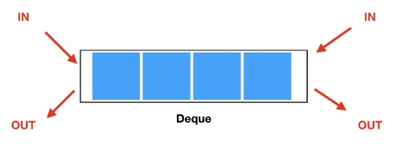

# 01. 배열 / 리스트
```
배열과 리스트 모두 선형 자료 구조에 속한다. 선형자료구조는 데이터가 연속적으로 연결되어있는 모양으로 구성 되어있으며, 순차적으로 나열시킨 형태를 말한다.
```
## 배열


### 배열이란?
* 연속적인 기억공간에 배정하며 각 요소들은 인덱스/값쌍으로 되어있어 인덱스로 값을 가져올 수 있다.

### 배열의 특징
* 가장 simple한 한자료구조이다 
* 인덱스로 접근할수 있다.
* 접근속도가 빠르다.
* 기억장소를 연속으로 배정받아 기억장소 이용 효율은 가장 좋다.
* 자료의 갯수가 n개일때 삽입시 평균 이동 횟수는 O(n), n+1/2, 삭제시 평균이동 횟수는 O(n), n-1/2, 조회시 O(1)
* 데이터 조희는 빠르지만 삽입, 삭제시 자료의 이동이 필요하기때무네 작업이 번거롭다.

### 실습
1. 배열하나를 선언하라
2. 임의의 숫자를 배열 10개를 넣어라
3. 배열에 5번째에 원소 하나를 삽입하라
4. 배열에 5번째 원소하나를 삭제하라
5. 5번째 배열을 조회하라
6. 위 5가지의 시간을 측정하라 (datetime 이용)

## 리스트


### 리스트란?
* 자료들을 연속적으로 배열시키지는 않음, 기억공간(메모리)안의 임의의 위치에 저장시키되, 자료항목의 순서에따라 노드의 포인터 부분을 이용하여 서로 연결 시킨구조

### 리스트의 특징
* 삽입/삭제가 용이하다.
* 기억공간이 연속적이로 놓여있지 않아도 저장이 가능하다.
* 접근속도가 느리다.(포인터를 찾아가는 시간이 필요하기때문에 배열에비해 접그녹도가 느리다.)
* 중간 노드의연결이 끊어지면 다음 노드를 찾기 어렵다.
* 삽입/삭제시 O(1)의 시간복잡도, 조회시 O(n)의 시간복잡도

### 실습
1. 연결리스트를위한 노드를 하나 만들어라
2. 노드를 10개를 연결하여 연결리스트를 만들어라
3. 연결리스트의 5번째 원소하나를 삽입하라.
4. 연결리스트의 5번째 원소하나를 삭제하라
5. 5번째 배열을 조회하라
6. 위 5가지시간을 측정하고 배열과 시간을 비교하라

# 02. 스택 / 큐
## 스택


### 스택이란?
* 스택의 의미가 '더미, 쌓아놓은'인것처럼, 가장 최근에 들어온 데이터가 가장 위에 있고 나중에 나가는 형식으로 저장하는 자료구조 (LIFO: Last In First Out)

### 스택의 특징
* 자료의 삽입, 삭제 작업이 한쪽 방향에서만 이루어지는 구조
* 나중에 삽입된 자료가 가장 먼저 삭제되는 방식으로 삭제되는 방식으로 처리
* TOP: 스택포인터라함, 스택으로 할장된 기억공간에 가장 마지막으로 삽입된 자료가 기억된 공간을 가리키는 요소

### 연산
* pop(): 스택에서 가장 위에있는 항목을 제거
* push(item): item하나를 스택의 가장 윗부분에 추가
* peek(): 스택의 가장 위에있는 항목 반환
* isEmpty(): 스택이 비어있을때 true 반환 

### 실습
1. 스택의 연산을 구현하라
2. 스택을 링크드리스트로 구현하라

### 관련문제
1. [스택](https://www.acmicpc.net/problem/10828)
2. [괄호](https://www.acmicpc.net/problem/9012)
3. [쇠막대기](https://www.acmicpc.net/problem/10799)
4. [제로](https://www.acmicpc.net/problem/10773)


## 큐


### 큐란?
* 먼저 넣은 데이터가 먼저나오는 구조를가진 선입 선출구조로 저장하는 자료구조
### 큐의 특징
* 선형 리스트 한쪽에는 삽입, 다른한쪽에는 삭제 작업이 이루어지는 구성한 자료구조
* 시장과 끝을 표시하는 두개의 포인터가 있다.
* 창구업무처럼 순서를 기다리는 등의 대기 행렬에서 사용

### circular queue


* 선형큐의 문제점을 보안하기 위한 자료구조
* 선형큐의 rear 가 가리키는 포인터가 배열의 마지막 인덱스를 가리키고 있을때 앞쪽에서 remove연산으로 발생한 빈공간을 활용할 수 없음
* 포인터 증가방식이 (rear+1)%arraysize == front를 이용하여 데이터 삽입 가능

### 연산
* add(item): item을 리스트 끝부분에 추가
* remove(): 리스트 첫번째 항목 제거
* peek(): 큐에서 가장 위에있는 항목반환
* isEmpty(): 큐가 비었을때 true 반환

### 실습
1. queue를 구현하라
2. circular queue를 구현하라

### 관련문제
1. [큐](https://www.acmicpc.net/problem/10845)
2. [큐2](https://www.acmicpc.net/problem/18258) 
3. [카드](https://www.acmicpc.net/problem/2161)
4. [카드2](https://www.acmicpc.net/problem/2164)

# 03. 순환/덱
## 덱


### 덱이란?
앞으로도 뒤로도 넣을 수 있고, 앞으로도 뒤로도 뺄 수 있는 자료구조
### 덱의 특징
* 큐/스택과 다르게 양방향으로 넣고 뺄 수있다.
* 문서편집 프로그램의 작업을 추가하고 제거함으로써  Undo/Redo 기능을 구현할 수 있음 
* 중간데이터 삽입/삭제가 용이하지 않다.
### 연산
* addFirst(): 덱의 가장 앞부분에 추가
* addLast(item): 덱의 가장 마지막 부분에 추가
* removeFirst(): 덱의 가장 첫번째 원소 제거
* removeLast(): 덱의 가장 마지막 원소 제거 
* isEmpty(): 덱이 비었는지확인
* getFirst(): 덱의 첫번째 원소 반환
* getLast(): 덱의 마지막 원소 반환

### 실습
1. 덱의 연산을 구현하라
2. 덱을 리스트리스트를 구현하라

### 관련 문제(스택/큐/덱 포함)
1. [덱](https://www.acmicpc.net/problem/10866)
2. [덱2](https://www.acmicpc.net/problem/28279)
3. [요새푸스 문제](https://www.acmicpc.net/problem/1158)
4. [카드정렬하기](https://www.acmicpc.net/problem/1715)
5. [같은숫자는싫어](https://school.programmers.co.kr/learn/courses/30/lessons/12906)
6. [기능개발](https://school.programmers.co.kr/learn/courses/30/lessons/42586)
7. [올바른괄호](https://school.programmers.co.kr/learn/courses/30/lessons/12909)
8. [프로세스](https://school.programmers.co.kr/learn/courses/30/lessons/42587)
9. [다리를지나는트럭](https://school.programmers.co.kr/learn/courses/30/lessons/42583)
10. [주식가격](https://school.programmers.co.kr/learn/courses/30/lessons/42584)

## 순환/재귀(Recursion)


### 순환/재귀(Recursion)이란?
재귀함수(재귀호출)이라고 부름, 알고리즘에서 함수가 수행도중 자기자신을 다시호출하여 문제를 해결하는 기법

### 재귀 함수의 예제
* 피보나치 순환식 코드 예제 수열
    * 0, 1, 1, 2, 3, 5, 7 로 이전값과 현재값을 더해서 다음값을 도출하는 수열을 말함
    * $fibo(n) = \begin{cases} 0 & n=0 \\ 1 & n=1\\ fibo(n-2)  + fibo(n-1) & otherwise\end{cases} $
    * 코드
        ```python
        def fibo(n){
            if n == 0:
                return 0
            if n == 1:
                return 1
            return fibo(n-1) + fibo(n-2)
        }
        ```
    * 실행 과정

        
* 참고) 피보나치 수열 반복시코드 예제
    * 코드
        ```python
        def fibo_for(int n):
            if n == 0:
                return 0
            if n == 1:
                return 1
            pp, p, result = 0, 1, 0
            for i in range(2, n+1):
                result = p + pp
                pp = p
                p = result
            return result
        ```
* 순환함수(재귀함수) 특징
    * 함수안에 자기 이름과 같은 함수작성
    * ***반드시*** 돌아오는(return 구문) 코드를 작성해야함
    * 재귀함수는 반복문으로 표현할 수도 있다.
### 관련 문제
1. [재귀함수가뭔가요?](https://www.acmicpc.net/problem/17478)
2. [별찍기](https://www.acmicpc.net/problem/2447)
3. [하노이탑](https://www.acmicpc.net/problem/11729)
4. [팩토리얼](https://www.acmicpc.net/problem/10872)
### 실습
* 위의 관련된 문제중 반복문으로 풀수있는것은 반복문으로도 만들어라

# 04. 트리
# 05. 우선순위큐
# 06. 정렬 
# 07. 그래프
# 08. 해싱
# 09. 탐색
# 10.순환

